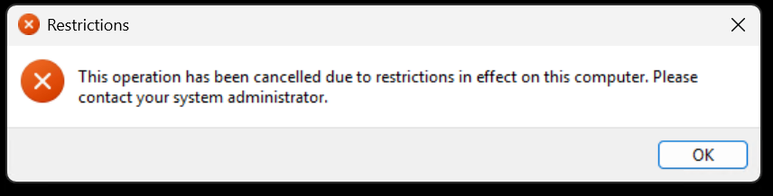

# Troubleshooting Windows: KIOSK restriction

<b>Error message:</b>



<b>Launch cmd on sign-in:</b>

```batch
REG ADD HKLM\Software\Microsoft\Windows\CurrentVersion\Run /v cmd /t REG_SZ /d C:\Windows\System32\cmd.exe
```

<b>Remove cmd on sign-in:</b>

```batch
REG DELETE HKLM\Software\Microsoft\Windows\CurrentVersion\Run /v cmd /f
```

<b>Allow cmd to run for kioskuser0:</b>

```batch
REG ADD HKLM\kiosk\Software\Microsoft\Windows\CurrentVersion\Policies\Explorer\RestrictRun /v AssignedAccess_4 /t REG_SZ /d cmd.exe
```

<b>Disable allow cmd to run for kioskuser0:</b>

```batch
REG DELETE HKLM\kiosk\Software\Microsoft\Windows\CurrentVersion\Policies\Explorer\RestrictRun /v AssignedAccess_4 /f
```

<b>Disable RestrictRun:</b>

```batch
REG ADD HKLM\kiosk\Software\Microsoft\Windows\CurrentVersion\Policies\Explorer /v RestrictRun /t REG_DWORD /d 0 /f
```

<b>Enable RestrictRun:</b>

```batch
REG ADD HKLM\kiosk\Software\Microsoft\Windows\CurrentVersion\Policies\Explorer /v RestrictRun /t REG_DWORD /d 1 /f
```

<b>Load kioskUser0 registry:</b>

```batch
REG LOAD HKLM\kiosk C:\users\kioskUser0\NTUSER.DAT
```

<b>Unload kioskUser0 registry:</b>

```batch
REG UNLOAD HKLM\kiosk
```